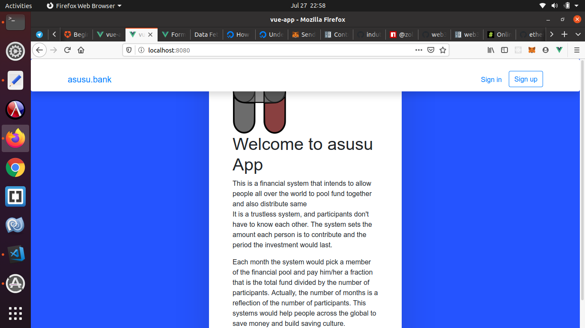
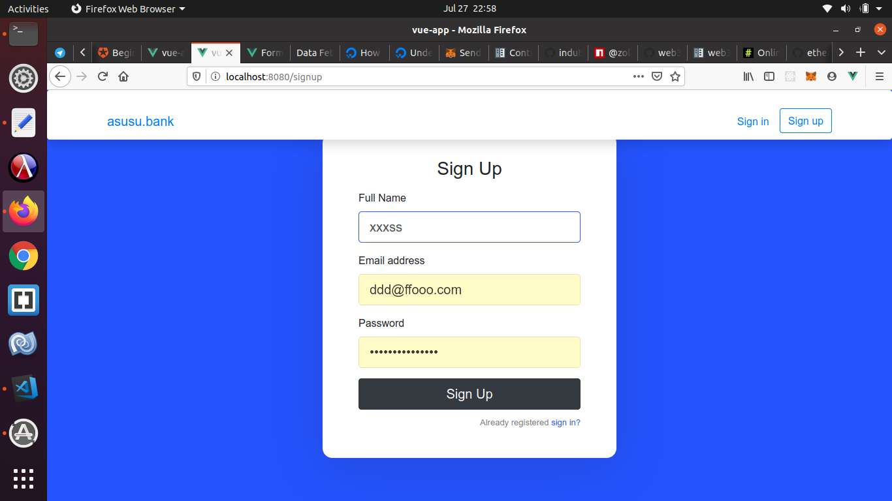
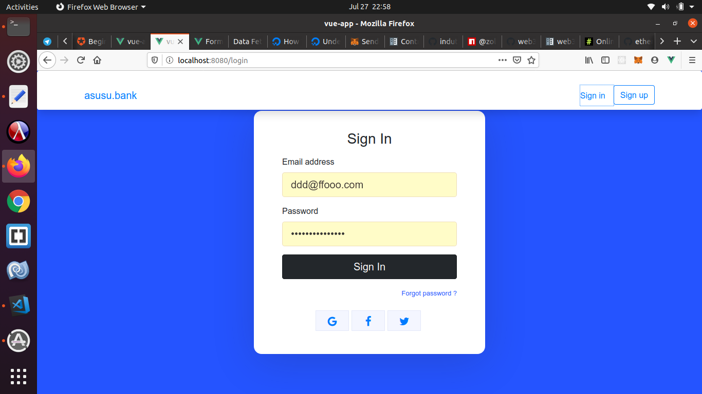
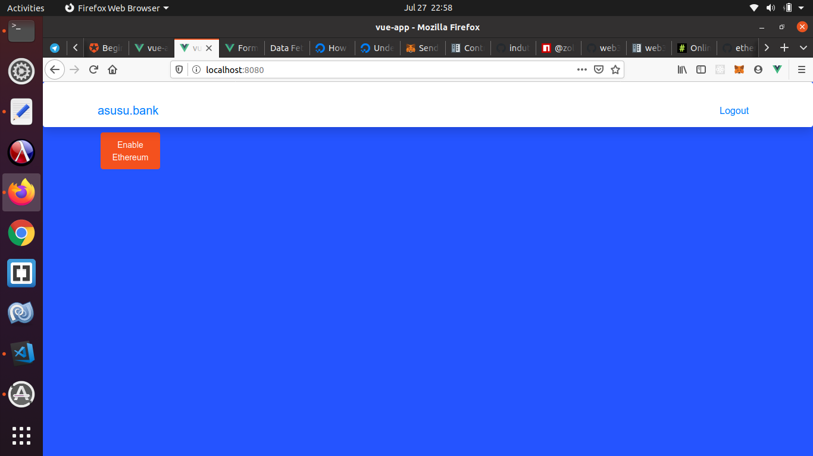
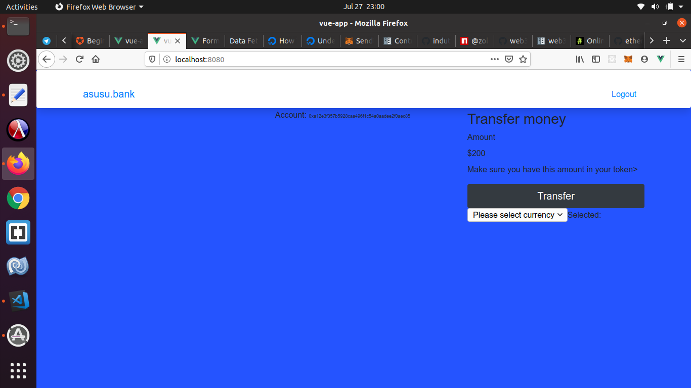
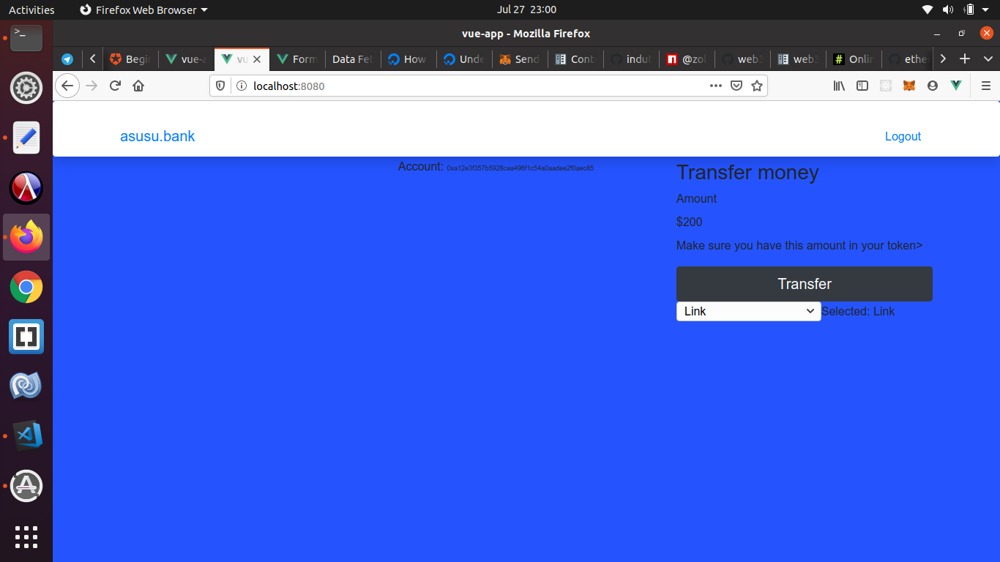
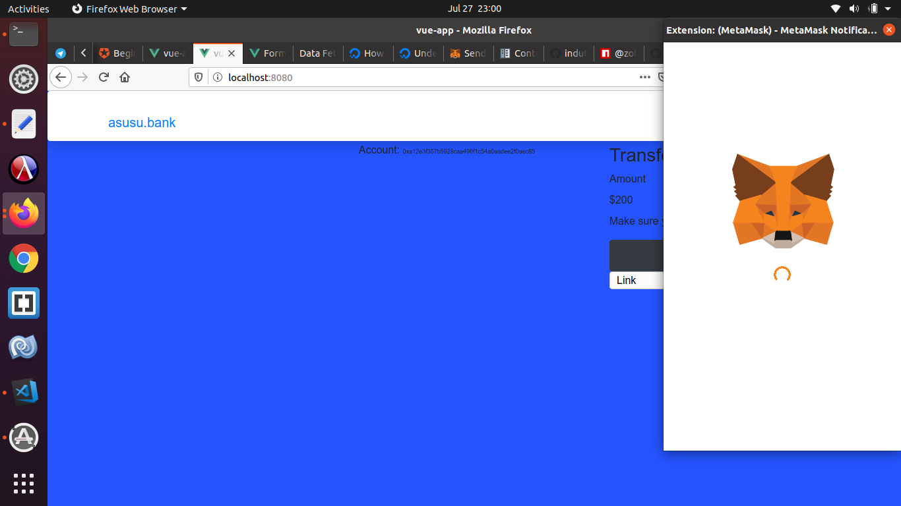

# vue-app

## Project setup
```
yarn install
```

### Compiles and hot-reloads for development
```
yarn run serve
```

### Compiles and minifies for production
```
yarn run build
```

# vue-app

## Project setup
```
yarn install
```

### Compiles and hot-reloads for development
```
yarn run serve
```
### Follow this guide

### Landing page



### Sign up


### Sign in


### Enable Wallet


### Enable Wallet


### Enable Wallet


### Enable Wallet



### Confirm and set up gas
.
